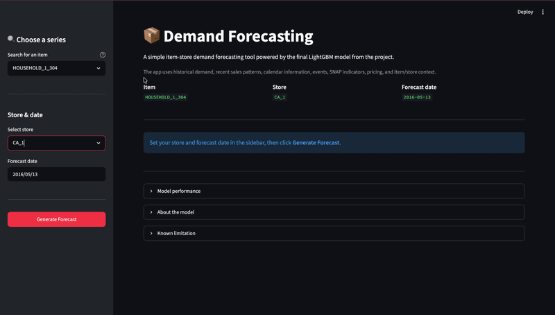

# Demand Forecasting

An end-to-end machine learning project for forecasting daily product demand at individual stores using historical sales, recent demand patterns, pricing, calendar information, events, and SNAP indicators.

The project uses the **M5 Forecasting - Accuracy** dataset and develops a LightGBM regression model, evaluates it on a future unseen period, and exposes the final model through a simple Streamlit application.

## Demo



The app lets a user search for an item, choose a store and forecast date, and generate a demand prediction using the trained model.

## Key Results

The final model was evaluated on an unseen 28-day test period.

| Metric | Final LightGBM |
|---|---:|
| MAE | **0.9056** |
| RMSE | **2.0219** |

Compared with a simple **Lag-1 baseline**, the final model reduced:

- **MAE by approximately 24%**
- **RMSE by approximately 23%**

The model performs particularly well on the large number of low-demand observations. Error increases for unusually high-demand observations, where the model tends to be more conservative and underpredict demand. This is treated as the main limitation and a clear direction for future improvement.

## Project Overview

The project follows a complete forecasting workflow:

1. Load and inspect the historical M5 data.
2. Reshape the sales data into a modeling-friendly format.
3. Integrate calendar, event, SNAP, and price information.
4. Create demand-history features such as lags and rolling means.
5. Use a chronological train/validation/test split.
6. Establish a Lag-1 baseline.
7. Train and compare LightGBM configurations.
8. Test additional feature/model variations.
9. Select the final model using validation performance.
10. Evaluate once on a completely unseen future test period.
11. Serve the trained model through Streamlit.

## Features

The final model uses:

- Item and store identifiers
- Department, category, and state information
- Weekday, month, and year
- Event information
- SNAP indicators
- Selling price and a price-missing indicator
- Lagged sales: `lag_1`, `lag_2`, `lag_3`, `lag_7`, `lag_14`, `lag_28`
- Rolling demand means: 7, 14, and 28 days

Recent demand history is especially useful because sales are strongly related to their own recent behavior.

## Modeling

The final model is a **LightGBM regression model with 128 leaves**.

Several controlled experiments were performed during model development. These included:

- Comparing a Lag-1 baseline with LightGBM
- Increasing model complexity from 31 to 64 to 128 leaves
- Adding short-term `lag_2` and `lag_3` features
- Testing a Poisson objective
- Testing a log-transformed target

The experiments that did not improve the original sales-scale evaluation were not retained in the final model.

The test set was kept separate from model selection so that the final reported performance represents an honest evaluation on future data.

## Evaluation

The final test period covers:

**2016-04-25 → 2016-05-22**

The evaluation notebook includes:

- MAE and RMSE
- Comparison with the Lag-1 baseline
- Actual vs predicted scatter plot
- Error analysis by demand level
- Aggregate daily actual vs predicted demand
- Feature importance
- Individual forecast examples

One important finding is that the model captures the overall movement of demand but tends to underestimate larger demand observations. Over the test period, the model predicted about 72% of total observed unit sales.

This limitation is documented rather than hidden, while the substantial improvement over the naive baseline is retained as the main model result.

## Streamlit App

The project includes a simple Streamlit interface for using the trained model.

### App workflow

1. Search for an item.
2. Select the desired item from the suggestions.
3. Select a store.
4. Choose a forecast date.
5. Generate the demand forecast.
6. Review recent demand history and, for historical dates, compare the prediction with actual sales.

The app uses the same feature logic as the modeling pipeline, including recent lags, rolling demand statistics, calendar information, events, SNAP, and price.

### Running the app

From the project root:

```bash
pip install -r requirements.txt
```

The large M5 datasets are intentionally not stored in this repository.

First, obtain the required M5 data and place it in the expected local `data/raw/` directory. Run the data-processing notebook to create the processed sales dataset, then create the compact app context:

```bash
python prepare_app_data.py
```

Finally:

```bash
streamlit run app.py
```

The app will open locally, usually at:

```text
http://localhost:8501
```

## Repository Structure

```text
demand-forecasting/
│
├── README.md
├── .gitignore
├── requirements.txt
├── app.py
├── prepare_app_data.py
│
├── notebooks/
│   ├── 01_data_processing.ipynb
│   ├── 02_model_training.ipynb
│   └── 03_model_evaluation.ipynb
│
├── models/
│   ├── final_lightgbm_model.pkl
│   └── final_feature_cols.pkl
│
├── data/
│   └── README.md
│
└── assets/
    └── demand_forecasting_demo.gif
```

## Data

The project uses the M5 Forecasting - Accuracy dataset.

The raw and processed datasets are not included in the repository because of their size. See [`data/README.md`](data/README.md) for the required files and setup instructions.

## Limitations and Future Work

The main limitation identified during evaluation is **underprediction of unusually high-demand observations**.

Potential future improvements include:

- Better calibration of high-demand forecasts
- More advanced demand-specific objectives
- Additional promotion and price dynamics
- More detailed time-series features
- Forecasting multiple days ahead rather than one day at a time

The current model is intended as a practical and interpretable forecasting baseline with a strong improvement over a simple persistence forecast.

## Tools Used

- Python
- Pandas
- NumPy
- Scikit-learn
- LightGBM
- Matplotlib
- Joblib
- Streamlit
- Parquet / PyArrow

## Dataset

**M5 Forecasting - Accuracy**

Kaggle competition:
https://www.kaggle.com/competitions/m5-forecasting-accuracy
